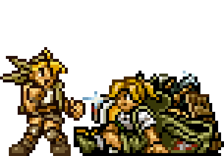

  
  <h1 align="center">Livraria do Hunter</h1>

##  Um pequeno acervo de livros da area de TI

A Livraria do Hunter disponibiliza de forma gratuita: conteúdo de domínio público e intelectual, com conhecimento acessível somos livres para chegar aonde quisermos.

## Como contribuir?

O nosso arquivo [CONTRIBUINDO](/CONTRIBUINDO.md) te ajuda detalhadamente a como contribuir com a gente! ;)

## Consciência social

<strong>Se você tem meios financeiros para comprar o livro, pedimos para fazê-lo, comprar em qualquer site de sua escolha ajuda aqueles que escreveram a produzir mais conteúdo de qualidade.</strong>

Caso seja possível, pedimos que você compre o livro, assim você ajuda aqueles que escreveram e os inspiram a produzir mais ainda.

## Desfrute do nosso acervo de livros

No momento nossa biblioteca é limitada mas de grande ajuda. Contamos com seu apoio para que ela cresça mais e mais.

## Hardware

- [Organização estruturada de computadores](https://github.com/The-Hydra-Labs/Livraria-do-hunter/blob/main/Ohara/Organiza%C3%A7%C3%A3o%20estruturada%20de%20computadores%20-%20Tanenbaum.pdf)

- [Arduino Descomplicado](https://github.com/The-Hydra-Labs/Livraria-do-hunter/blob/main/Ohara/(Arduino%20Descomplicado)%20Claudio%20Luis%20Vieira%20Oliveira_%20Humberto%20Augusto%20Piovesana%20Zanetti%20-%20Arduino%20Descomplicado_%20Como%20Elaborar%20Projetos%20de%20Eletr%C3%B4nica-%C3%89rica%20(2015).pdf)

## Algoritmos

- [Execicios Algoritmos](https://github.com/The-Hydra-Labs/Livraria-do-hunter/blob/main/Ohara/Exercicios%20de%20Algoritmos.pdf)

## Contribuidores

### Este projeto existe graças a todas as pessoas que contribuem. [[Contribua](/CONTRIBUINDO.md)].

<table>
  <tr>
    <td align="center">
      <a href="https://github.com/lemostrash">
        
         
        
          <b>Lemostrash</b>
        
      </a>
    </td>
  </tr>
</table>
